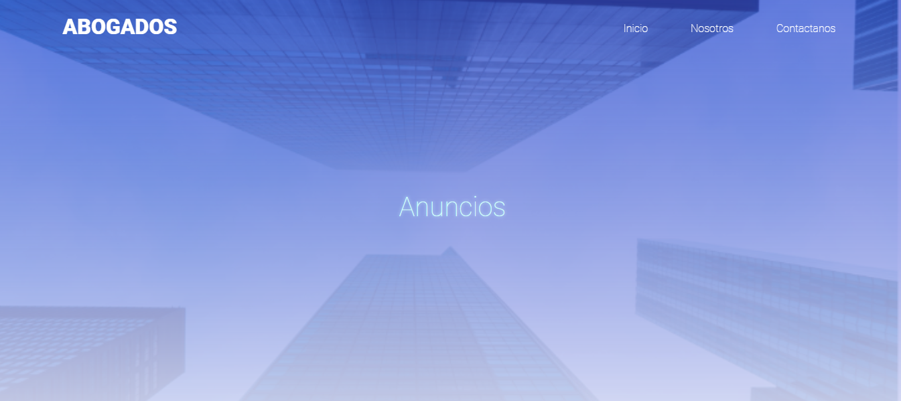

<h1>Negocios de abogados o aferente</h1>

    </img>

<h1>Como Correr el proyecto</h1>
<ul>
<li>Clonar el repositorio </li>
<li>Abrir el archivo index.html en el navegador </li>
</ul>

<h1>RESUMEN</h1>

    El sitio web cuenta con una pagina principal donde se encuetra informacion general de la empresa.

    </img>

    Cuenta con un nav horizontal donde se puede navegar las diferentes vistas del sitio web.

<ul>
<li>Nosotros</li>

    En esta pagina se encuetra la informacion sobre la empresa y sobre el equipo de trabajo.

    </img>

<li>Anuncios</li>

    En esta pagina se encuetra los ultimos casos estudiades por nuetro equipo de trabajo.

    </img>

<li>Contactanos</li>

    En esta pagina se muestra la ubicacion, el telefono y el E-mal, ademas de un formulario para contactarse con la empresa.

    </img>

</ul>
<h1>ANIMACIONES</h1>

   La pagina cuenta con diferentes animaciones las cuales se relizaron en JavaScript utilizando skrollr.js

    </img>

    </img>

<h1>RESPONSIVE</h1>

    La aplicacion cuenta con responsive web la cual parte de los 900px y 600px para una mejor experiencia de usuario:

    menu nav mobile

    </img>

    </img>

    tag de opciones

    </img>

    <h1> TECNOLOGIAS USADAS </h1>
        <h2>FRONTEND</h2>
        <ul>
            <li>HTML5 </li>
            <li>CSS3</li>
            <li>Java Script</li>
        </ul>

